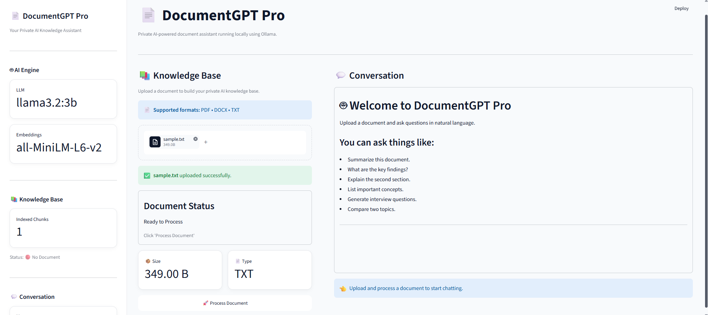
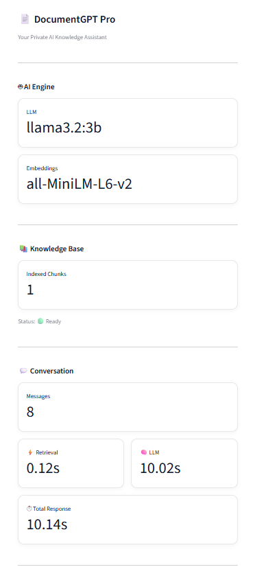
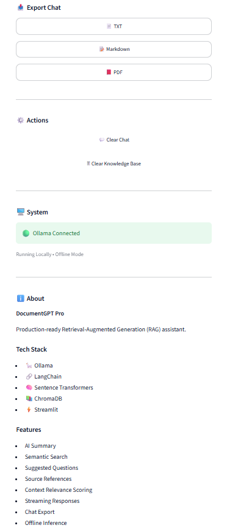

<p align="center">

# 📄 DocumentGPT Pro

### AI-Powered Document Intelligence using Retrieval-Augmented Generation (RAG)

Private • Local LLM • Semantic Search • Context-Aware Answers • 100% Offline


</p>

<p align="center">


</p>

<p align="center">


</p>

---

# 🌟 Overview

**DocumentGPT Pro** is a production-inspired **Retrieval-Augmented Generation (RAG)** application that enables users to chat intelligently with their own documents using natural language.

Instead of relying solely on a Large Language Model (LLM), the application retrieves the most relevant document sections using **semantic vector search**, builds contextual prompts, and generates accurate, grounded responses through a locally running **Llama 3.2** model powered by **Ollama**.

Unlike conventional AI chatbots, DocumentGPT Pro minimizes hallucinations by providing the language model with only the most relevant document context before answer generation.

The entire application executes **locally**, ensuring complete privacy without sending user data to external APIs or cloud services.

---

# ✨ Key Highlights

- 📄 Chat with PDF, DOCX, and TXT documents
- 🧠 Retrieval-Augmented Generation (RAG)
- 🔍 Semantic similarity search using vector embeddings
- 📚 ChromaDB vector database
- 🤖 Local inference with Ollama (Llama 3.2)
- ⚡ Streaming AI responses
- 📑 AI-generated document summaries
- 💡 Suggested document-specific questions
- 📊 Document insights and statistics
- 🎯 Context relevance scoring
- 📖 Source-grounded responses
- 📤 Export conversations (TXT, Markdown, PDF)
- 🔒 100% Offline & Privacy-first
- 🎨 Modern Streamlit interface

---

# 🚀 Why DocumentGPT Pro?

Traditional chatbots answer questions using only their pretrained knowledge, which often results in outdated information or hallucinated responses.

DocumentGPT Pro solves this limitation through a Retrieval-Augmented Generation pipeline.

Instead of asking the LLM to answer from memory alone, the system:

1. Reads your document.
2. Splits it into meaningful chunks.
3. Generates semantic embeddings.
4. Stores them in a vector database.
5. Retrieves only the most relevant sections.
6. Uses those retrieved sections as context.
7. Produces accurate, context-aware answers.

This architecture significantly improves response quality while maintaining complete data privacy.

---

# 🎯 Objectives

The primary objectives of this project are:

- Build a fully offline AI document assistant.
- Demonstrate a complete Retrieval-Augmented Generation pipeline.
- Showcase semantic search using embeddings.
- Integrate modern LLM orchestration with LangChain.
- Develop a clean, modular, production-inspired architecture.
- Provide an intuitive interface for document analysis.
- Minimize hallucinations through context-aware retrieval.
- Deliver a scalable foundation for enterprise knowledge assistants.

---

# 📑 Table of Contents

- 🌟 Overview
- ✨ Key Highlights
- 🎯 Objectives
- 🚀 Features
- 🏗 System Architecture
- ⚙ Technology Stack
- 🔄 RAG Workflow
- 🧠 AI Pipeline
- 📂 Project Structure
- 📸 Screenshots
- 🚀 Installation
- 💻 Usage
- 📊 Context Relevance Scoring
- 📚 Source Grounding
- ⚡ Performance
- 🧪 Testing
- 🔮 Future Improvements
- 🤝 Contributing
- 📜 License
- 👨‍💻 Author

---

# 🚀 Features

DocumentGPT Pro combines modern Retrieval-Augmented Generation (RAG) techniques with an intuitive interface to provide an intelligent document analysis experience.

---

## 📄 Multi-Format Document Support

Upload and interact with multiple document formats:

- PDF
- Microsoft Word (.docx)
- Plain Text (.txt)

Each uploaded document is automatically parsed, cleaned, and prepared for semantic indexing.

---

## 🧠 AI Document Summarization

Immediately after processing, the application generates an AI-powered summary that captures the most important information from the uploaded document.

This helps users quickly understand lengthy documents without reading every page.

---

## 💬 Conversational AI

Ask questions in natural language such as:

- What is the document about?
- Summarize Chapter 3.
- Explain the methodology.
- List important concepts.
- Generate interview questions.
- Compare two topics.

The AI responds conversationally while remaining grounded in the uploaded document.

---

## 🔍 Semantic Search

Instead of traditional keyword matching, DocumentGPT Pro performs semantic similarity search using sentence embeddings.

This enables retrieval based on meaning rather than exact words, resulting in significantly more accurate answers.

---

## 📚 Retrieval-Augmented Generation (RAG)

The application implements a complete Retrieval-Augmented Generation pipeline.

Rather than relying solely on the LLM's internal knowledge, the system retrieves relevant document chunks and injects them into the prompt before answer generation.

Benefits include:

- Reduced hallucinations
- Improved factual accuracy
- Context-aware responses
- Better explainability

---

## 📖 Source Grounding

Every generated answer is accompanied by the document chunk(s) that contributed to the response.

This allows users to verify AI outputs and increases trust in generated answers.

---

## 📊 Context Relevance Scoring

Each retrieval operation produces a relevance score indicating how well the retrieved document context matches the user's query.

The score is calculated from ChromaDB vector similarity distances and presented as:

- Excellent
- High
- Medium
- Low

---

## 📈 Document Insights

Automatically generated document statistics include:

- Total Pages
- Word Count
- Character Count
- Estimated Reading Time
- Indexed Chunks

These insights provide a quick overview of uploaded content.

---

## 💡 Suggested Questions

The application automatically generates intelligent questions based on the uploaded document, helping users explore the content more effectively.

---

## ⚡ Streaming Responses

Responses are streamed token-by-token to simulate real-time AI interaction.

This improves responsiveness and provides a modern conversational experience.

---

## 📤 Export Chat

Conversations can be exported as:

- TXT
- Markdown
- PDF

making it easy to save AI-generated insights.

---

## 🔒 Privacy First

Unlike cloud-based AI assistants, DocumentGPT Pro processes documents locally.

No document content is transmitted to external servers.

Your data remains entirely on your machine.

---

# ⚙️ Technology Stack

| Category | Technology |
|------------|------------|
| Programming Language | Python 3.12 |
| Frontend | Streamlit |
| LLM | Llama 3.2 (Ollama) |
| AI Framework | LangChain |
| Embedding Model | all-MiniLM-L6-v2 |
| Embedding Provider | Hugging Face Sentence Transformers |
| Vector Database | ChromaDB |
| PDF Processing | PyPDF2 |
| DOCX Processing | python-docx |
| Chat Export | ReportLab |
| Local Inference | Ollama |
| Architecture | Retrieval-Augmented Generation (RAG) |

---

# 🏗️ System Architecture

<p align="center">


</p>

The application follows a modular Retrieval-Augmented Generation architecture.

The workflow consists of:

1. Document Upload
2. Document Parsing
3. Recursive Text Chunking
4. Embedding Generation
5. Vector Storage
6. Semantic Retrieval
7. Context Construction
8. Prompt Engineering
9. Local LLM Inference
10. Streaming Response Generation

This architecture ensures scalability, maintainability, and accurate context-aware responses.

---

# 🧩 Core Components

| Component | Responsibility |
|------------|----------------|
| Document Loader | Reads uploaded documents |
| Chunking Engine | Splits documents into semantic chunks |
| Embedding Generator | Converts text into dense vectors |
| ChromaDB | Stores vector embeddings |
| Retriever | Retrieves the most relevant chunks |
| Context Builder | Builds LLM context |
| Ollama | Generates answers locally |
| Streamlit UI | User Interface |
| Export Module | Saves conversations |

---

# 🔄 Retrieval-Augmented Generation (RAG) Workflow

```

                User Uploads Document
                         │
                         ▼
               Document Loader
                         │
                         ▼
               Text Extraction
                         │
                         ▼
           Recursive Text Chunking
                         │
                         ▼
       SentenceTransformer Embeddings
                         │
                         ▼
          ChromaDB Vector Storage
                         │
────────────────────────────────────────────

                User asks Question
                         │
                         ▼
            Semantic Similarity Search
                         │
                         ▼
              Top Relevant Chunks
                         │
                         ▼
             Context Construction
                         │
                         ▼
            Ollama (Llama 3.2)
                         │
                         ▼
          Streaming AI Response
                         │
                         ▼
          Answer + Source References

```

---

# 💡 Why Retrieval-Augmented Generation?

Traditional LLMs answer based only on pretrained knowledge.

RAG significantly improves response quality by retrieving document-specific information before generation.

### Advantages

- Lower hallucination rate
- Better factual accuracy
- Transparent source attribution
- More relevant responses
- Scalable knowledge base
- Domain-specific intelligence

This makes RAG particularly suitable for enterprise knowledge assistants, document search systems, legal assistants, research tools, and internal company documentation.

---

# 📂 Project Structure

The project follows a modular architecture to keep components independent, reusable, and maintainable.

```text
DocumentGPT-Pro/
│
├── assets/
│   ├── banner.png
│   ├── architecture.png
│   └── style.css
│
├── chroma_db/
│
├── components/
│   ├── chat.py
│   ├── sidebar.py
│   ├── workspace.py
│   ├── uploader.py
│   ├── summary.py
│   ├── source_view.py
│   ├── statistics.py
│   ├── document_insights.py
│   ├── suggested_questions.py
│   └── ...
│
├── screenshots/
│   ├── home.png
│   ├── upload.png
│   ├── workspace.png
│   ├── conversation.png
│   ├── insights.png
│   ├── sidebar-top.png
│   └── sidebar-bottom.png
│
├── tests/
│   ├── test_loader.py
│   ├── test_rag.py
│   └── test_vector_store.py
│
├── uploads/
│
├── utils/
│   ├── chunking.py
│   ├── context_builder.py
│   ├── document_loader.py
│   ├── document_processor.py
│   ├── embeddings.py
│   ├── export_chat.py
│   ├── llm.py
│   ├── prompts.py
│   ├── question_generator.py
│   ├── summarizer.py
│   ├── vector_store.py
│   └── ...
│
├── app.py
├── config.py
├── requirements.txt
├── README.md
└── .gitignore
```

---

# 🚀 Installation

## 1️⃣ Clone Repository

```bash
git clone https://github.com/nakul85/DocumentGPT-Pro.git

cd DocumentGPT-Pro
```

---

## 2️⃣ Create Virtual Environment

Windows

```bash
python -m venv venv

venv\Scripts\activate
```

Linux / macOS

```bash
python3 -m venv venv

source venv/bin/activate
```

---

## 3️⃣ Install Dependencies

```bash
pip install -r requirements.txt
```

---

## 4️⃣ Install Ollama

Download Ollama from:

https://ollama.com/download

After installation, pull the required model:

```bash
ollama pull llama3.2:3b
```

Verify installation:

```bash
ollama list
```

---

## 5️⃣ Run the Application

```bash
streamlit run app.py
```

The application will automatically open in your browser.

---

# ⚙ Configuration

The application configuration can be customized inside:

```text
config.py
```

You can modify:

- LLM Model
- Embedding Model
- Chunk Size
- Chunk Overlap
- Number of Retrieved Chunks
- Streaming Parameters
- Temperature
- Context Window

without changing the application logic.

---

# 💻 Usage Guide

## Step 1

Upload a document.

Supported formats:

- PDF
- DOCX
- TXT

---

## Step 2

Click

```
🚀 Process Document
```

The application will:

- Read the document
- Clean the text
- Generate embeddings
- Store vectors
- Generate AI summary
- Generate suggested questions
- Compute document insights

---

## Step 3

Ask questions naturally.

Examples:

```
Summarize the document.

What are the key concepts?

Explain the methodology.

Generate interview questions.

List important topics.

Compare Chapter 2 and Chapter 4.

What is Retrieval-Augmented Generation?

Explain the conclusion.
```

---

## Step 4

The system retrieves the most relevant chunks before querying the LLM.

The generated answer is displayed together with:

- Retrieved Sources
- Conversation History
- Streaming Response
- Export Options

---

# 🧠 AI Pipeline

```
User Document
      │
      ▼
Document Parsing
      │
      ▼
Cleaning & Preprocessing
      │
      ▼
Recursive Chunking
      │
      ▼
Sentence Transformer
      │
      ▼
Vector Embeddings
      │
      ▼
ChromaDB Storage
      │
      ▼
User Question
      │
      ▼
Semantic Retrieval
      │
      ▼
Context Builder
      │
      ▼
Prompt Engineering
      │
      ▼
Ollama Llama 3.2
      │
      ▼
Streaming Answer
```

---

# 📦 Major Dependencies

| Library | Purpose |
|----------|---------|
| Streamlit | User Interface |
| LangChain | RAG Framework |
| ChromaDB | Vector Database |
| Sentence Transformers | Embeddings |
| Ollama | Local LLM |
| PyPDF2 | PDF Parsing |
| python-docx | DOCX Parsing |
| ReportLab | PDF Export |
| NumPy | Numerical Processing |

---

# 🔐 Privacy & Security

One of the major goals of DocumentGPT Pro is complete user privacy.

Unlike cloud AI platforms:

✅ Documents never leave your computer

✅ No API keys required

✅ Local vector database

✅ Local embeddings

✅ Local LLM inference

This makes the application suitable for:

- Enterprise documents
- Legal documents
- Research papers
- Medical reports
- Internal company documentation
- Academic notes

# 📸 Application Showcase

The following screenshots demonstrate the major capabilities of DocumentGPT Pro.

---

## 🏠 Home Page

The landing page provides a clean interface for uploading documents and initializing the AI-powered knowledge base.

<p align="center">


</p>

---

## 📤 Upload & Process Document

After selecting a document, the application validates the file and prepares it for indexing.

<p align="center">



</p>

---

## 🧠 AI Workspace

The workspace displays automatically generated document summaries, insights, suggested questions, and document statistics.

<p align="center">


</p>

---

## 💬 AI Conversation

Users can ask natural language questions and receive streaming responses grounded in the uploaded document.

<p align="center">


</p>

---

## 📊 Document Insights

The dashboard provides useful analytics about the uploaded document.

Displayed metrics include:

- Number of Pages
- Word Count
- Character Count
- Reading Time
- Indexed Chunks

<p align="center">


</p>

---

## ⚙ Sidebar

The sidebar provides:

- AI Configuration
- Knowledge Base Status
- Conversation Analytics
- Export Options
- System Information

<p align="center">





</p>

---

# 💬 Example Conversation

### User

> Summarize this document.

### AI

> The document discusses Retrieval-Augmented Generation (RAG), semantic search, vector databases, and local language model inference using Ollama. It explains how embeddings enable context-aware retrieval and improve the factual accuracy of generated responses.

---

### User

> What is Retrieval-Augmented Generation?

### AI

> Retrieval-Augmented Generation (RAG) combines semantic retrieval with Large Language Models. Instead of relying only on pretrained knowledge, the system retrieves relevant document chunks from a vector database and injects them into the prompt before generating an answer.

---

### User

> Generate interview questions from this document.

### AI

> • Explain Retrieval-Augmented Generation.

> • What is semantic similarity search?

> • Why are embeddings required?

> • What role does ChromaDB play?

> • How does Ollama enable local inference?

---

# 📊 Performance Overview

| Feature | Status |
|----------|--------|
| Local LLM Inference | ✅ |
| Offline Execution | ✅ |
| Semantic Search | ✅ |
| Streaming Responses | ✅ |
| AI Summarization | ✅ |
| Suggested Questions | ✅ |
| Source Attribution | ✅ |
| Conversation Export | ✅ |
| Multi-format Documents | ✅ |

---

# 🧪 Testing

Basic tests are included to verify core functionality.

Current test modules:

```text
tests/

├── test_loader.py

├── test_rag.py

└── test_vector_store.py
```

These tests validate:

- Document Loading
- Chunk Generation
- Vector Storage
- Retrieval Pipeline

---

# 📈 Performance Highlights

DocumentGPT Pro was designed with a focus on usability, modularity, and efficient local inference.

### Highlights

- Local execution using Ollama
- No cloud API dependency
- Lightweight Streamlit interface
- Modular architecture
- Fast semantic retrieval
- Context-aware prompting
- Streaming response generation
- Source-grounded answers

---

# 🏆 Engineering Highlights

This project demonstrates practical implementation of modern AI engineering concepts.

Implemented concepts include:

- Retrieval-Augmented Generation (RAG)
- Semantic Search
- Vector Databases
- Local LLM Deployment
- Prompt Engineering
- Context Construction
- Conversation Memory
- AI Summarization
- Document Intelligence
- Streaming UI
- Modular Python Architecture

---

# 💡 Challenges Solved

### Large Documents

Long documents exceed LLM context windows.

**Solution**

Recursive chunking combined with semantic retrieval.

---

### Hallucinated Responses

Generic LLMs may generate inaccurate answers.

**Solution**

Inject retrieved document context into prompts.

---

### Privacy

Cloud-based AI services require uploading documents.

**Solution**

Run everything locally using Ollama.

---

### Retrieval Accuracy

Keyword search misses semantic meaning.

**Solution**

Use Sentence Transformers and vector embeddings.

---

### Maintainability

Large monolithic applications become difficult to extend.

**Solution**

Adopt a modular component-based architecture.

---