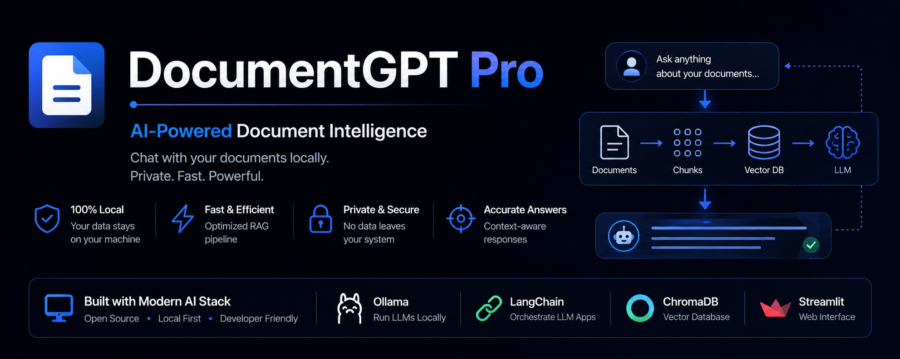
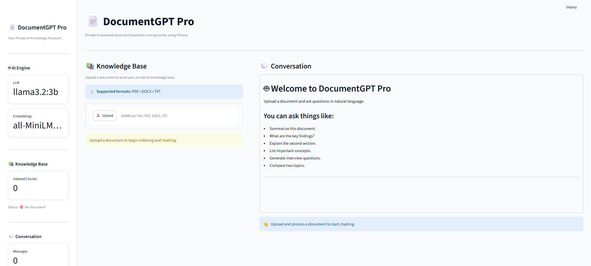
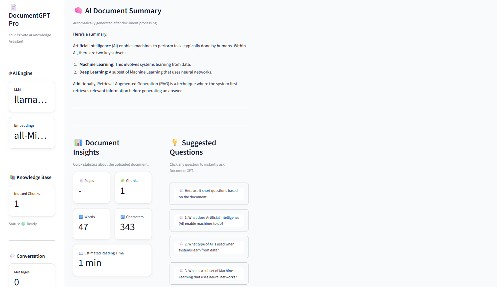
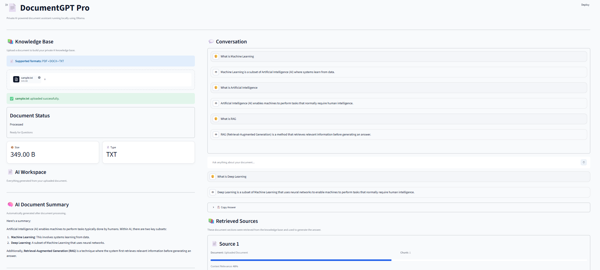
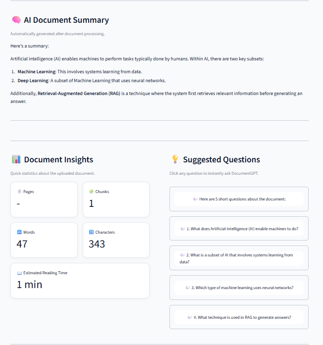
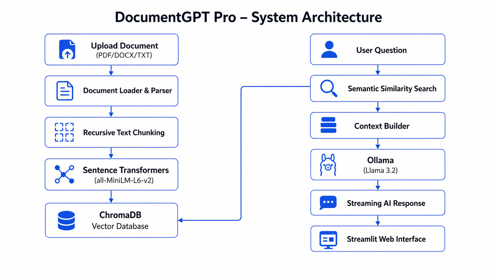

<p align="center">
  
</p>

<h1 align="center">📄 DocumentGPT Pro</h1>

<p align="center">
<strong>AI-Powered Document Intelligence using Retrieval-Augmented Generation (RAG)</strong>
</p>

<p align="center">
Build a private AI knowledge assistant that understands your documents using semantic search, vector databases, and local Large Language Models.
</p>

<p align="center">


</p>

---

# 📖 Overview

DocumentGPT Pro is a production-inspired **Retrieval-Augmented Generation (RAG)** application that allows users to upload **PDF**, **DOCX**, and **TXT** documents and interact with them using natural language.

Instead of sending an entire document to a Large Language Model, the application retrieves only the most semantically relevant document chunks using **Sentence Transformers** and **ChromaDB** before generating responses with **Llama 3.2** running locally through **Ollama**.

The entire pipeline runs completely offline, making the application privacy-friendly while demonstrating modern AI engineering concepts such as vector databases, embeddings, semantic search, prompt engineering, and conversational document intelligence.

---

# ✨ Features

| 🤖 AI | 📄 Documents | ⚡ User Experience |
|------|--------------|-------------------|
| Retrieval-Augmented Generation | PDF | Streaming Responses |
| Semantic Search | DOCX | Suggested Questions |
| Ollama Local LLM | TXT | Copy Answer |
| AI Summarization | Multi-page Support | Export Chat |
| Context Relevance | Source References | Modern UI |
| Conversation Memory | Document Insights | Fully Offline |

---

# 🎯 Why DocumentGPT Pro?

Large Language Models are powerful but cannot answer questions about your private documents unless those documents are supplied as context.

DocumentGPT Pro solves this using a complete Retrieval-Augmented Generation pipeline.

Instead of relying on the model's internal knowledge, the system:

- Parses uploaded documents
- Splits text into semantic chunks
- Generates vector embeddings
- Stores embeddings in ChromaDB
- Retrieves only the most relevant context
- Generates grounded answers using Ollama

This approach produces more accurate, explainable, and context-aware responses while keeping all data local.

---

## 🖼️ Application Preview

### 🏠 Home

The landing page provides a clean interface for uploading and processing documents.

<p align="center">

</p>

---

### 🧠 AI Workspace

The workspace presents AI-generated summaries, suggested questions, document insights and statistics.

<p align="center">

</p>

---

### 💬 Intelligent Conversation

Chat naturally with your documents while viewing retrieved source references.

<p align="center">

</p>

---

### 📊 Document Insights

Automatically generated document statistics help users quickly understand uploaded content.

<p align="center">

</p>


---


# 🏗️ System Architecture

<p align="center">



</p>

The application follows a modular Retrieval-Augmented Generation (RAG) architecture.

**Pipeline Overview**

1. Upload document
2. Extract document text
3. Split into semantic chunks
4. Generate vector embeddings
5. Store embeddings in ChromaDB
6. Retrieve relevant document chunks
7. Construct contextual prompt
8. Generate answer using Ollama
9. Stream the response back to the user


---


# 🛠️ Technology Stack

| Layer | Technology |
|--------|------------|
| Programming Language | Python 3.12 |
| Frontend | Streamlit |
| AI Framework | LangChain |
| Large Language Model | Llama 3.2 (Ollama) |
| Embeddings | all-MiniLM-L6-v2 |
| Embedding Framework | Sentence Transformers |
| Vector Database | ChromaDB |
| PDF Processing | PyPDF2 |
| DOCX Processing | python-docx |
| PDF Export | ReportLab |


---


# 📂 Project Structure

The project follows a modular architecture where each module has a single responsibility, making the application easier to maintain, extend, and test.

```text
DocumentGPT-Pro/
│
├── assets/                 # Banner, architecture diagram & custom styling
├── chroma_db/              # ChromaDB vector database
├── components/             # Reusable Streamlit UI components
├── screenshots/            # README screenshots
├── tests/                  # Unit tests
├── uploads/                # Uploaded documents
├── utils/                  # Core AI, RAG and helper modules
│
├── app.py                  # Main application
├── config.py               # Application configuration
├── requirements.txt        # Python dependencies
├── README.md
└── .gitignore
```


---


# 🚀 Installation

## 1. Clone the Repository

```bash
git clone https://github.com/nakul85/DocumentGPT-Pro.git

cd DocumentGPT-Pro
```

---

## 2. Create a Virtual Environment

Windows

```bash
python -m venv venv

venv\Scripts\activate
```

Linux / macOS

```bash
python3 -m venv venv

source venv/bin/activate
```

---

## 3. Install Dependencies

```bash
pip install -r requirements.txt
```

---

## 4. Install Ollama

Download Ollama from:

https://ollama.com/download

Pull the required model:

```bash
ollama pull llama3.2:3b
```

Verify installation:

```bash
ollama list
```

---

## 5. Run the Application

```bash
streamlit run app.py
```

The application will automatically launch in your browser.

---


# 💻 Usage


### Step 1

Upload a document.

Supported formats:

- PDF
- DOCX
- TXT

---

### Step 2

Click **🚀 Process Document**

The application automatically:

- Extracts document text
- Splits the content into semantic chunks
- Generates vector embeddings
- Stores vectors in ChromaDB
- Creates an AI-generated summary
- Generates suggested questions
- Calculates document insights

---

### Step 3

Ask questions naturally.

Example prompts:

```text
Summarize this document.

Explain the key concepts.

Generate interview questions.

What are the important findings?

Explain the conclusion.

Compare two topics.

What is Retrieval-Augmented Generation?
```

---

### Step 4

The application retrieves the most relevant document chunks before querying the LLM.

The generated response includes:

- AI-generated answer
- Retrieved source references
- Context relevance score
- Streaming response
- Conversation history

---


# 🧠 RAG Pipeline


```text
Document
    │
    ▼
Text Extraction
    │
    ▼
Recursive Chunking
    │
    ▼
Sentence Transformers
    │
    ▼
Vector Embeddings
    │
    ▼
ChromaDB
    │
User Question
    │
    ▼
Similarity Search
    │
    ▼
Context Builder
    │
    ▼
Ollama (Llama 3.2)
    │
    ▼
Streaming Response
```

---


# 🔒 Privacy


DocumentGPT Pro is designed with privacy as a core principle.

- ✅ No cloud APIs
- ✅ No external document uploads
- ✅ Local vector database
- ✅ Local embedding generation
- ✅ Local LLM inference

All processing is performed entirely on your machine.


---

# 🚀 Future Improvements

Although DocumentGPT Pro is fully functional, several enhancements can further extend its capabilities.

- 📂 Multi-document knowledge base
- 🔍 Hybrid Search (Keyword + Semantic Search)
- 🖼 OCR support for scanned PDFs
- 🎤 Voice-based document interaction
- 🌐 Cloud deployment (AWS, Azure or GCP)
- 👥 User authentication and document management
- 📑 Citation highlighting within documents
- 📱 Responsive mobile interface
- 🌍 Multi-language document support
- 🧠 Support for larger local language models

---

# 📌 Project Highlights

✅ Retrieval-Augmented Generation (RAG)

✅ Semantic Search using Sentence Transformers

✅ Local LLM Inference with Ollama

✅ Vector Database using ChromaDB

✅ AI-powered Document Summarization

✅ Suggested Question Generation

✅ Context Relevance Scoring

✅ Source-grounded Responses

✅ Conversation Export

✅ Modular Python Architecture

✅ Offline & Privacy-first Design

---

# 📜 License

This project is licensed under the **MIT License**.

Feel free to use, modify, and distribute this project under the terms of the MIT License.

---

# 👨‍💻 Author

**Nakul Firodiya**

AI Engineer | Python | Machine Learning | Generative AI | Retrieval-Augmented Generation (RAG)

### Connect with Me

- **GitHub:** https://github.com/nakul85
- **LinkedIn:** *(Add your LinkedIn profile here)*

---

# 🙏 Acknowledgements

This project was built using several outstanding open-source technologies.

Special thanks to the communities behind:

- Ollama
- LangChain
- ChromaDB
- Hugging Face
- Streamlit
- Sentence Transformers

Their work makes modern AI application development accessible to everyone.

---

<p align="center">

### ⭐ If you found this project helpful, consider giving it a Star!

</p>